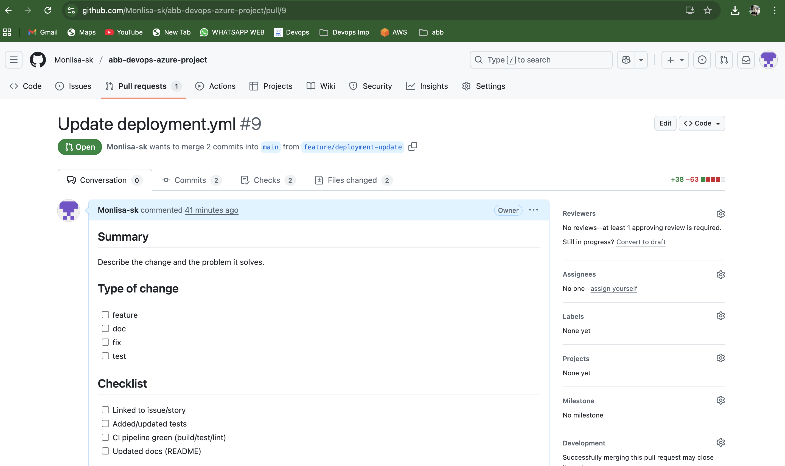
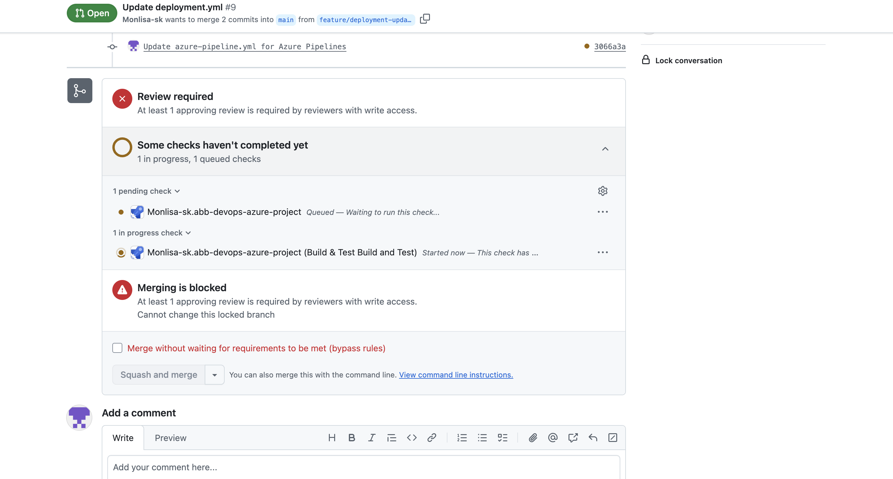

## 📌 Problem Statement
Design and demonstrate a branching workflow strategy in Git that supports feature development, pull requests, and controlled merges to the main branch.

---

## ⚙️ Solution Approach
- Documented the branching model in **branching-strategy.md**:
  - `main` → production-ready code
  - `feature/*` → short-lived branches for new work
  - `release/*` → stabilize for prod
  - `hotfix/*` → emergency fixes (out of scope for demo)
- Created a feature branch, committed changes, and opened a **Pull Request (PR)**.
- Demonstrated the **code review process** (approval + comments).
- Merged changes back into `main` after review.
- Captured screenshots of the PR and review to serve as proof.

---

## 📂 Files in this Folder
- [branching-strategy.md](branching-strategy.md) → Document describing the branching workflow.
- `screenshots/`  
  - `pull_request.png` → Example PR raised from feature → main.  
  - `code_review.png` → Code review/approval stage.  

---

## ✅ Proof of Execution
  

