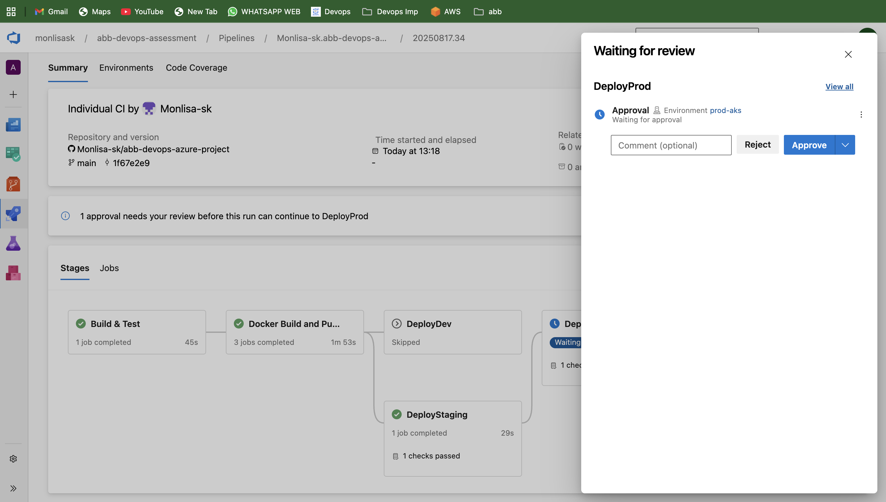

# Continuous Deployment (CD)

## 📌 Problem Statement
Extend the CI pipeline to deploy the application to **Azure App Service or AKS**, with approval gates for production.

---

## ⚙️ Solution Approach
- Started with the existing **CI pipeline** (`azure_pipeline.yml`) which already builds + tests code.
- Added a **CD pipeline** to handle deployments.
- Defined **three stages**:
  1. **Build Stage** – Restore dependencies, compile, build image, and push to ACR.
  2. **Test Stage** – Run unit tests automatically and publish results.
  3. **Deploy Stage** – 
     - Manual **approval gate** required for Production.
     - Pull image from ACR and deploy to **AKS** using `k8s-deployment.yaml`.
     - Verified pods and services are healthy post-deployment.

- Final pipeline flow:  
  **Commit → Build → Test → Approval → Deploy → Application Available**

---

## 📂 Files in this Folder
- `azure_pipeline.yml` → CI definition (build + test) + CD pipeline extension (deploy to AKS). 
- `deployment_logs.zip` → Archived deployment logs from Azure DevOps.  
- `screenshots/`  
  - `approval_config.png` → Proof of approval step before prod deploy.
    `manual_approval.png` → Proof of approval step before prod deploy.
  - `cicd-pipeline-success.png` → CD pipeline run success.  

---

## ✅ Proof of Execution
- **Approval Gate:**  
  

- **Deployment Logs:**  
  Found in `deployment.logs.zip` showing successful `kubectl apply` 

- **Pipeline Success:**  
  

