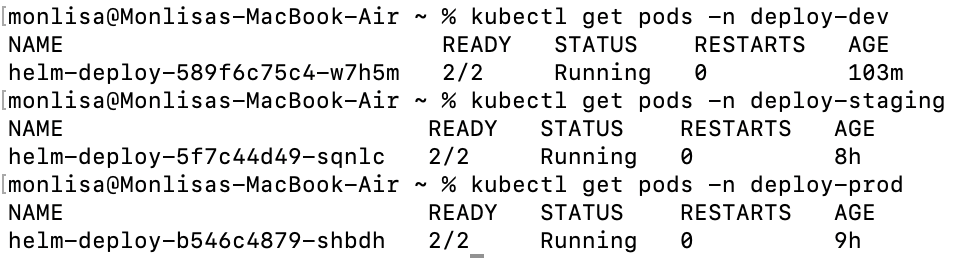
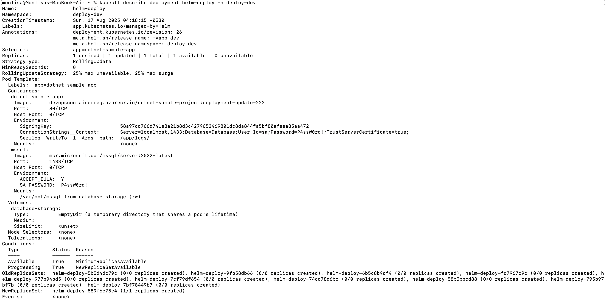

## 📌 Problem Statement
Deploy the containerized application to Azure Kubernetes Service (AKS) using Kubernetes manifests and provide deployment screenshots as proof.

---

## ⚙️ Solution Approach
- Prepared a **Deployment** manifest for the application.
- Included basic readiness/liveness probes and minimal resource requests.
- Applied the manifest to AKS .
- Captured:
  - `kubernetes_pods.png` → Pods in Running/Ready state
  - `kubernetes_describe.png` → `kubectl describe` details confirming a healthy rollout

---

## 📂 Files in this Folder
- [deployment.yml](../../dotnet-sample-project/helmchart/templates/deployment.yml) — Kubernetes Deployment manifest for the app.
- `screenshots/`
  - `kubernetes_pods.png` — Pods running and Ready.
  - `kubernetes_describe.png` — Describe output showing conditions/events.

---

## ✅ Proof of Execution
  

---

