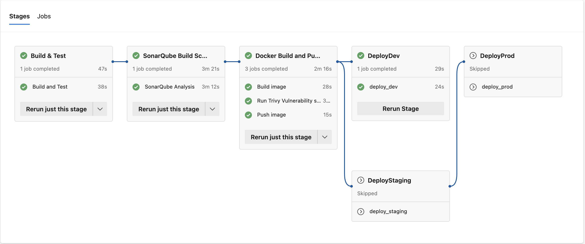

## 📌 Problem Statement
Create a multi-stage pipeline in Azure DevOps that handles deployments across multiple environments (Dev, QA, Prod) with environment-specific variables and validation gates.

---

## ⚙️ Solution Approach
- Implemented a **multi-stage** Azure DevOps pipeline in `azure-pipeline.yml` with stages:
  - **Dev** → automatic deploy on merge.
  - **QA** → deploy after Dev; includes **manual approval** gate.
  - **Prod** → deploy after QA success; final release gate.
- Used **environment-scoped variables** (defined inside the YAML) to vary image tags, replicas, and configuration per stage.
- Integrated deployment to AKS/Apps using tasks/Helm/manifests inside each stage.
- Verified a full run across **Dev → QA → Prod**.

---

## 📂 Files in this Folder
- `azure-pipeline.yml` — Multi-stage pipeline (Dev, QA, Prod) with embedded env variables and approvals.
- `screenshots/`
  - `multi-stage-success.png` — Successful multi-stage execution across all environments.
# Multi-Stage Pipeline (Dev → QA → Prod)

## 📌 Problem Statement
Create a multi-stage pipeline in Azure DevOps that handles deployments across multiple environments (Dev, QA, Prod) with environment-specific variables and validation gates.

---

## ⚙️ Solution Approach
- Implemented a **multi-stage** Azure DevOps pipeline in `azure-pipeline.yml` with stages:
  - **Dev** → automatic deploy on merge.
  - **QA** → deploy after Dev; includes **manual approval** gate.
  - **Prod** → deploy after QA success; final release gate.
- Used **environment-scoped variables** (defined inside the YAML) to vary image tags, replicas, and configuration per stage.
- Integrated deployment to AKS/Apps using tasks/Helm/manifests inside each stage.
- Verified a full run across **Dev → QA → Prod**.

---

## 📂 Files in this Folder
- `azure-pipeline.yml` — Multi-stage pipeline (Dev, QA, Prod) with embedded env variables and approvals.
- `screenshots/`
  - `multi-stage-success.png` — Successful multi-stage execution across all environments.

---

## ✅ Proof of Execution

---
